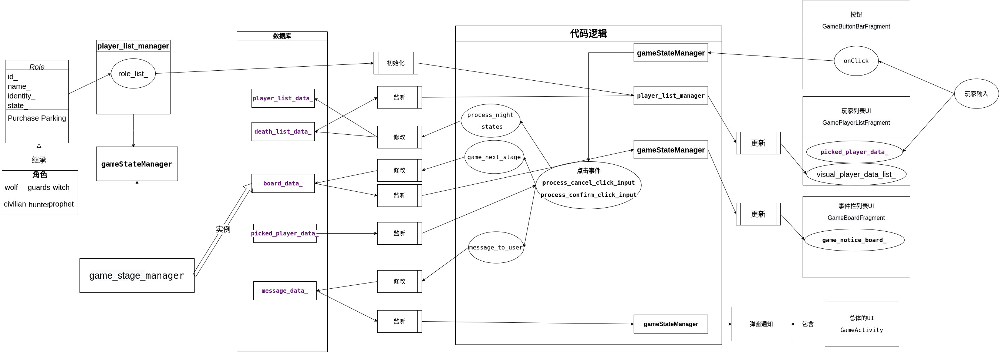

# 狼人杀裁判辅助系统

java大作业：狼人杀裁判辅助软件


## 内容列表

- [狼人杀裁判辅助系统](#狼人杀裁判辅助系统)
    - [内容列表](#内容列表)
    - [背景](#背景)
    - [开发过程](#开发过程)
    - [项目类图](#项目类图)
    - [使用说明](#使用说明)
    - [安装](#安装)
    - [相关仓库](#相关仓库)
    - [维护者](#维护者)
    - [使用许可](#使用许可)

## 背景
线下狼人杀的时候，在玩家过多的时候，裁判通常需要使用手机来记录各个事件。但是时间一长，难免犯错。
于是，我写了狼人杀裁判辅助系统，帮助裁判记事。


## 开发过程

本项目100%使用了Java进行开发，使用AndroidStudio进行开发。基本上是一边学一边开发的，所以代码上可以明显看出来，
列表的实现分别使用了ListView和RecycleView，消息提醒有Toast和Jetpack推荐的方式。

整体过程还是比较有意思的，接触到了数据库和gui的搭建，体会到了识图和代码逻辑分离的软件架构（虽然说很常见）。
同时，也清楚了解了，写代码之前最好先明确思路，手写一些逻辑图，不然真的光盯着代码发呆。

这个程序写的代码是有史以来最多的一次。最困难的地方在于各个视图及其背后数据库的交互。本项目使用了JetPack推荐的设计模式，
将activity和实际的逻辑分开，各个识图都有一个类来管理。

## 项目类图



## 使用说明

```
    Game
    ├── 游戏页面
    │    
    ├── 角色设置
    │    
    └── 玩家设置
```

在设置的页面中，点击即删除该项内容，游戏中的操作可以参考提示进行，整体的操作是不言自明的。


## 安装
当前软件APK仅适合安卓系统，也可以尝试使用安卓虚拟器。

如果想要看看软件效果，可以查看本仓库的Releases


## 相关仓库

- [Art of Readme](https://github.com/noffle/art-of-readme) — 💌 写高质量 README 的艺术。
- [open-source-template](https://github.com/davidbgk/open-source-template/) — 一个鼓励参与开源的 README 模板。

## 维护者

[@SCNU 凌绍彬](https://github.com/AB-pixel-pixel)。


## 使用许可

[MIT](LICENSE) 
